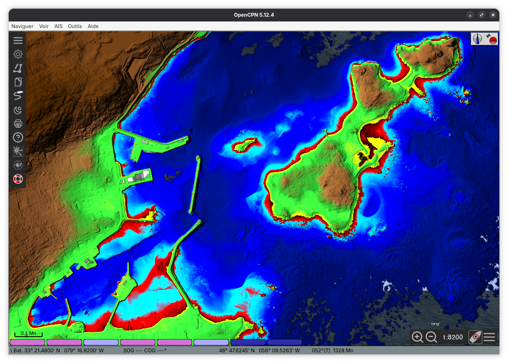

# litto3d-to-mbtiles

Convert LITTO3D bathymetry files (.asc) to MBTiles for OpenCPN, optimized for navigation with a low draft sailboat.


*Example output - Saint-Pierre-et-Miquelon*

## Features

- Convert MNT 1M / 5M resolution to MBTiles
- Zoom levels 10-22
- Multidirectional hillshade for terrain relief
- Bathymetric color table adapted for Saint-Pierre-et-Miquelon waters
- OpenCPN compatible

## Color Code

- **10m and above**: Brown shades — land and terrain relief
- **2m to 10m**: Green shades — areas not covered at high tide
- **0m to 2m**: Yellow to light green — potentially covered at high tide
- **-1.5m to 0m**: Red to black — danger zones at low tide
- **-3m to -1.5m**: Light blue to cyan to red — navigable shallow waters
- **-200m to -3m**: Dark to light blue — deep waters without hazards

NoData values (unmapped areas) are rendered transparent.

## Requirements

- GDAL ≥ 3.8
- Python 3.10+
- mb-util (optional, for optimized MBTiles packing)

## Installation

```sh
# Clone the repository
git clone https://github.com/yourusername/litto3d-spm.git
cd litto3d-spm

# Install dependencies (nix)
nix-shell
```

## Usage

### Single file or folder

```sh
python3 litto3d_to_mbtiles.py <litto3d_dir> <output.mbtiles> [options]
```

**Example:**

```sh
python3 litto3d_to_mbtiles.py ./LITTO3D_SPM spm_bathymetry.mbtiles
```

**Options:**

| Option | Description | Default |
|--------|-------------|---------|
| `--resolution` | MNT resolution (1M or 5M) | 1M |
| `--zoom-min` | Minimum zoom level | 10 |
| `--zoom-max` | Maximum zoom level | 18 |
| `--processes` | Parallel processes for gdal2tiles | 8 |
| `--resampling` | Resampling method | bilinear |
| `--keep-tmp` | Keep temporary files for debug | false |

### Multi-level pipeline

Generate complete multi-level MBTiles coverage:

```sh
python3 update-mbtiles.py <source_dir> <output_dir>
```

This creates:
- `large/global-ZZZZ.mbtiles` - Low-res coverage (zoom 10-16)
- `medium/XXXX_XXXX.mbtiles` - Medium-res tiles (zoom 17-20)
- `small/XXXX_XXXX-YYYYYYYY.mbtiles` - High-res tiles (zoom 21-22, optional)

## Output

The generated MBTiles include:
- Bathymetric depths (negative values: water)
- Topographic heights (positive values: land)
- Multidirectional hillshade overlay
- Transparent NoData areas

## License

MIT License - See [LICENSE](LICENSE) file.

## Credits

- LITTO3D data: Service Hydrographique et Océanographique Marine (SHOM)
- OpenCPN: Open-source chart plotter
