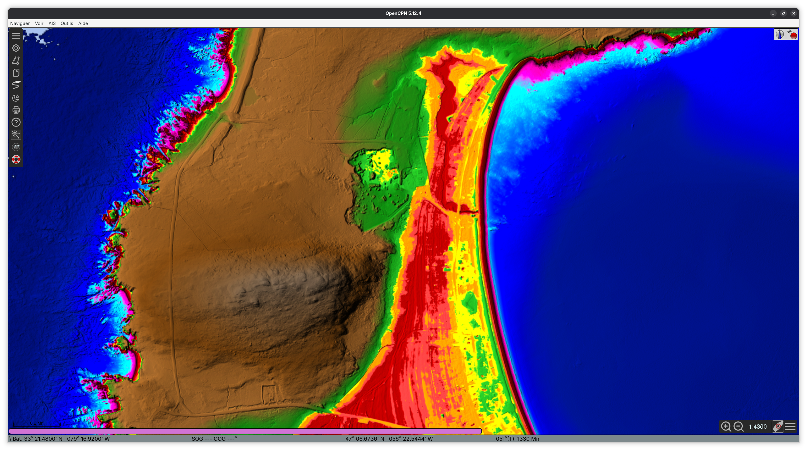
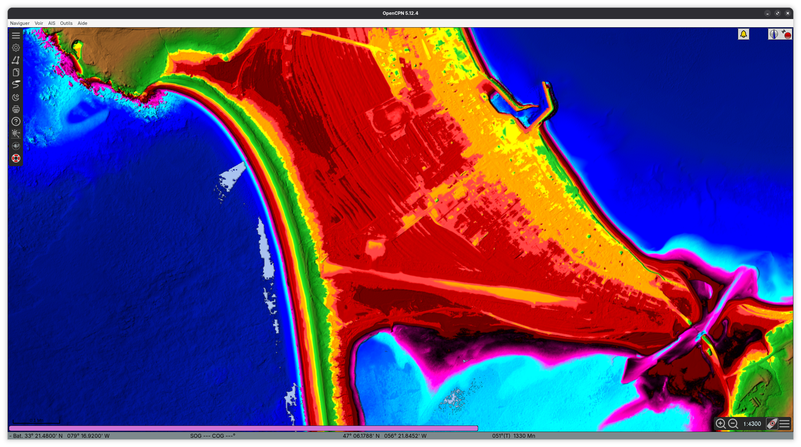

# Infos Marée & Montée des eaux à SPM

Table des couleurs optimisée pour le niveau des eaux de SPM.

_Niveau des eaux - Miquelon Nord_

_Niveau des eaux - Miquelon Sud_

Légende des couleurs : 

- Noir : niveau de la mer à marée basse
- Rouge foncé : inondable (delta de marnage)
- Rouge : inondable à marée haute (delta de marnage)
- Rouge clair : inondable à marée haute de très fort coef (120)
- Orange : inondable à l'horizon 2010 (fort coef)
- Jaune : inondable à l'horizon 2010 (prévision pessimiste)
- Vert et + : non inondable

## Hauteur d'eau à marée haute pour un fort coefficient (120) à Saint-Pierre-et-Miquelon

La hauteur d'eau à marée haute pour un coefficient de 120 (vives eaux de grande amplitude, coefficient maximal) est d’environ **2,29 à 2,31 m** au-dessus du zéro des cartes (zéro hydrographique / chart datum).  

- **Pleine Mer Supérieure Grande Marée** : 2,29 m  
- **Plus Haute Mer Astronomique** (valeur théorique maximale) : 2,31 m  

Ces valeurs proviennent des données officielles de marées pour la station Saint-Pierre-et-Miquelon (équivalentes aux prédictions SHOM, car les services hydrographiques français et canadiens utilisent des référentiels compatibles pour cette zone). Elles correspondent aux grandes marées de coefficient 120 et ne varient pas « actuellement » : ce sont des constantes astronomiques calculées à partir des harmoniques de marée. Les hauteurs réelles observées lors des prochaines grandes marées (selon les prévisions SHOM ou sites comme meteospm.org) tournent autour de 2,0 à 2,3 m selon le coefficient exact et les surcotes météo.

## Niveau de montée des eaux attendu d’ici 2100 et évolution des estimations

Les études locales spécifiques à Saint-Pierre-et-Miquelon (utilisées pour le Plan de prévention des risques littoraux – PPRL – approuvé en 2018) retiennent une **hausse du niveau marin d’environ 0,7 m à l’horizon 2100**.  

- Observation historique locale : +2 à 3 mm/an entre 1993 et 2011 (données BRGM).  
- Projection retenue : +0,7 m d’ici 2100 (hypothèse BRGM 2011, confirmée dans les études du PPRL et synthèses CEREMA). Certaines projections récentes (Météo-France / DRIAS) indiquent +30 à 40 cm d’ici 2050 et environ +70 cm d’ici 2090-2100. Ce chiffre est légèrement supérieur à la moyenne mondiale du GIEC, en raison de facteurs régionaux (effets de la fonte des glaces au Canada/Groenland et dynamique océanique locale).

## Évolution des estimations

- Les premières projections (GIEC AR4, années 2000) étaient plus basses (environ 0,4 m en scénario optimiste à 0,6 m en pessimiste pour la fin du siècle).  
- Avec les rapports suivants (AR5 puis AR6), les incertitudes sur la dynamique des calottes glaciaires (Groenland et Antarctique) ont fait monter les fourchettes : le GIEC AR6 donne une plage probable mondiale de 0,28–0,55 m (scénario bas émissions) à 0,63–1,01 m (scénario haut émissions) d’ici 2100 par rapport à 1995-2014.  
- Pour Saint-Pierre-et-Miquelon, les autorités françaises (BRGM, CEREMA, PPRL) ont conservé l’hypothèse prudente de **0,7 m** dans les documents d’aménagement, car elle intègre déjà une part des incertitudes régionales et permet de dimensionner les ouvrages de protection (ex. : route de Langlade, isthme Miquelon-Langlade). Les estimations n’ont pas été revues à la hausse de manière significative dans les documents locaux récents, mais les scénarios extrêmes du GIEC (incluant une instabilité rapide des glaces) pourraient dépasser 1 m dans le pire des cas.

## Sources

- **Niveaux de marée (Pleine Mer Supérieure Grande Marée à 2,29 m et Plus Haute Mer Astronomique à 2,31 m pour coefficient ~120)**  
  - Service hydrographique du Canada – Station Saint-Pierre Et Miquelon (00745) : 
    [http://www.marees.gc.ca/fr/stations/00745](http://www.marees.gc.ca/fr/stations/00745)

- **Prédictions de marées officielles (SHOM)**  
  - SHOM – Horaires des marées à Île Saint-Pierre :  
    [https://maree.shom.fr/harbor/ILE_SAINT-PIERRE](https://maree.shom.fr/harbor/ILE_SAINT-PIERRE)  
  - Météo SPM (reproduction SHOM) :  
    [http://www.meteospm.org/maree.php](http://www.meteospm.org/maree.php)

- **Hausse du niveau marin de 0,7 m d’ici 2100 et observations locales**  
  - CEREMA – Synthèse des connaissances sur le littoral de Saint-Pierre-et-Miquelon :  
    [https://www.cerema.fr/fr/actualites/dynamiques-evolutions-du-littoral-synthese-Miquelon](https://www.cerema.fr/fr/actualites/dynamiques-evolutions-du-littoral-synthese-Miquelon) (référence BRGM 2011 pour le PPRL)

- **Documents officiels PPRL et BRGM**  
  - Projet PPRL – Affiche aléa (hausse +70 cm en 2100) :  
    [https://www.saint-pierre-et-miquelon.developpement-durable.gouv.fr/IMG/pdf/projet-pprl-spm_affiche_alea_miq_internet.pdf](https://www.saint-pierre-et-miquelon.developpement-durable.gouv.fr/IMG/pdf/projet-pprl-spm_affiche_alea_miq_internet.pdf)  
  - BRGM – Vulnérabilité du littoral (NMR 2100) :  
    [https://www.saint-pierre-et-miquelon.developpement-durable.gouv.fr/IMG/pdf/2016_vulnerabilite_littoral_SPM_Risques-cotiers_BRGM.pdf](https://www.saint-pierre-et-miquelon.developpement-durable.gouv.fr/IMG/pdf/2016_vulnerabilite_littoral_SPM_Risques-cotiers_BRGM.pdf)
